<div align="center">


<br />


<br />
<br />


<br />
<br />

<a href="https://github.com/nanonymoussu">
  
</a>
<a href="https://www.linkedin.com/in/nanonymoussu">
  
</a>
<a href="mailto:nanon2546@gmail.com">
  
</a>
<a href="https://github.com/nanonymoussu">
  
</a>

<br />
<br />


</div>

---

## About

I am **Nanon Singhasurasak**, a **23-year-old Software Engineer at Aeronautical Radio of Thailand LTD.**, focused on building secure, scalable, and maintainable software systems for production environments.

My daily engineering work centers on **Java Spring Boot**, **Thymeleaf**, **OracleDB**, **Maven**, **TailwindCSS**, **Lombok**, **Bean Validation**, **Keycloak**, **Redis**, **MinIO**, **OAuth2**, **Docker**, **Node.js**, and **NginX**. I work across backend systems, database-driven applications, authentication flows, infrastructure tooling, and enterprise web platforms.

I approach software engineering with a **product engineering mindset**: designing systems that are reliable, user-focused, operationally practical, and maintainable beyond the first release. My background in telecommunications engineering strengthens my understanding of networks, systems thinking, performance constraints, and engineering discipline.

I also build personal projects across **full-stack development**, **AI / ML / LLM applications**, backend APIs, developer tooling, and modern web platforms using **TypeScript**, **Go**, **Python**, **Rust**, **React**, **Next.js**, **Vue**, **Nuxt**, **FastAPI**, **Elysia.js**, **Nest.js**, **PostgreSQL**, **MongoDB**, **Docker**, and cloud-native tooling.

<br />

**Open To**

- Software Engineering roles focused on backend, full-stack, platform, or product engineering
- AI / ML engineering projects involving LLMs, automation, data products, and intelligent systems
- Open-source collaboration around developer tools, backend frameworks, and modern web systems
- Enterprise-grade product engineering with strong security, scalability, and maintainability requirements

---

## Tech Stack

<div align="center">

### Languages


<br />
<br />

### Frontend


<br />
<br />

### Backend & Databases


<br />
<br />

### Cloud, DevOps & Tooling


</div>

<br />

<div align="center">

| Category | Technologies |
|---|---|
| **Enterprise Backend** | Java Spring Boot, Maven, Lombok, Bean Validation, OAuth2, Keycloak |
| **Frontend Engineering** | Thymeleaf, React.js, Next.js, Vue.js, Nuxt.js, TailwindCSS, DaisyUI, Shadcn/ui |
| **Backend Frameworks** | Elysia.js, FastAPI, Flask, Axum, Actix, Fiber, Gin, Express.js, Nest.js |
| **Databases & Storage** | OracleDB, PostgreSQL, MySQL, MongoDB, Redis, MinIO |
| **ORM & Data Access** | Hibernate, Prisma ORM, Drizzle ORM |
| **Infrastructure** | Docker, Docker Compose, NginX, Unix CLI, Git, Maven |
| **AI / ML / LLM** | AI workflows, ML concepts, LLM applications, intelligent automation |

</div>

---

## AI / ML Expertise

<div align="center">

| Domain | Proficiency | Details |
|---|---:|---|
| **LLM Application Engineering** | Advanced | Building AI-assisted systems, LLM-powered workflows, prompt-driven automation, and developer productivity tools |
| **AI Product Integration** | Advanced | Integrating intelligent features into full-stack applications with strong usability and product value |
| **Machine Learning Foundations** | Intermediate | Understanding ML pipelines, model usage patterns, evaluation concepts, and applied AI workflows |
| **Backend for AI Systems** | Advanced | Designing APIs, storage layers, authentication, queue-friendly services, and scalable infrastructure for AI-enabled products |
| **Data Engineering Basics** | Intermediate | Working with structured data, SQL databases, document databases, caching, and service-level data flows |
| **AI Developer Tooling** | Advanced | Using AI to accelerate development, debugging, documentation, testing, and architectural iteration |

</div>

---

## Featured Projects

<details>
<summary><strong>Food Self-Ordering Kiosk System</strong></summary>

<br />

A full-stack self-ordering kiosk platform designed as an engineering capstone project. The system connects a customer-facing kiosk, Android application, backend APIs, database layer, and administrative dashboard into a complete food ordering workflow.

<br />

| Attribute | Details |
|---|---|
| **Stack** | Next.js, Kotlin Android, Backend APIs, SQL Database, REST Architecture |
| **Scale** | Multi-client architecture connecting kiosk, mobile application, and admin dashboard |
| **Performance** | Optimized API communication and database structure for responsive ordering flows |
| **Security** | Role-based administrative access patterns and structured backend data handling |
| **Impact** | Demonstrates full-lifecycle product engineering from system design to implementation |
| **Repository** | [View on GitHub](https://github.com/nanonymoussu) |

<br />

This project reflects end-to-end engineering ownership: backend API design, database modeling, admin interface development, Android integration, and operational thinking around order flow reliability. It demonstrates the ability to move beyond isolated features and build a connected product ecosystem.

</details>

<br />

<details>
<summary><strong>Enterprise Equipment Maintenance Request System</strong></summary>

<br />

An internal web application developed during internship experience at Wire & Wireless Co., Ltd. The platform supported equipment maintenance request workflows and helped digitize operational processes for internal users.

<br />

| Attribute | Details |
|---|---|
| **Stack** | PHP, Bootstrap, XAMPP, MySQL |
| **Scale** | Internal enterprise workflow system |
| **Performance** | Practical CRUD-oriented request handling with database-backed operations |
| **Security** | Controlled internal usage with structured form and data management |
| **Impact** | Improved practical understanding of enterprise web development and database-backed applications |
| **Repository** | [View on GitHub](https://github.com/nanonymoussu) |

<br />

The project strengthened practical software engineering fundamentals through real-world application development, database management, interface design, and internal workflow automation. It provided direct experience with building systems for operational users and business processes.

</details>

<br />

<details>
<summary><strong>GUI Network Scanning Tools</strong></summary>

<br />

A high-performance network scanning tool built to detect open TCP and UDP ports, paired with a Python-based graphical user interface for practical network analysis and security auditing.

<br />

| Attribute | Details |
|---|---|
| **Stack** | Rust, Python, GUI Tooling, TCP/UDP Networking |
| **Scale** | Local network scanning and security analysis workflows |
| **Performance** | Rust-based scanner designed for fast and efficient port detection |
| **Security** | Supports network visibility, auditing, and system inspection use cases |
| **Impact** | Bridges low-level systems programming with practical user-facing tooling |
| **Repository** | [View on GitHub](https://github.com/nanonymoussu) |

<br />

This project combines systems-level performance with usability. Rust was used for scanning performance and reliability, while Python provided a more accessible interface for interpreting network results. It highlights engineering range across networking, systems programming, and user-facing tooling.

</details>

<br />

<details>
<summary><strong>USB 3.1 Physical Layer Simulation</strong></summary>

<br />

A Python-based digital communications simulation created to analyze physical layer behavior of the USB 3.1 protocol. The project explored signal behavior, protocol characteristics, and communication system fundamentals.

<br />

| Attribute | Details |
|---|---|
| **Stack** | Python, Digital Communications Concepts, Signal Analysis |
| **Scale** | Academic protocol simulation and analysis |
| **Performance** | Computational simulation focused on protocol behavior and physical layer understanding |
| **Security** | Supports deeper understanding of communication reliability and system-level behavior |
| **Impact** | Connects telecommunications engineering foundations with software-based simulation |
| **Repository** | [View on GitHub](https://github.com/nanonymoussu) |

<br />

The simulation demonstrates the ability to translate engineering theory into executable software models. It reflects strong analytical thinking, protocol-level understanding, and practical use of Python for technical simulation.

</details>

<br />

<details>
<summary><strong>Speech Signal Enhancement with MATLAB</strong></summary>

<br />

A signal processing project focused on improving speech clarity through frequency-domain analysis and filtering. The implementation used FFT-based processing to identify and reduce unwanted frequency components.

<br />

| Attribute | Details |
|---|---|
| **Stack** | MATLAB, FFT, Signal Processing |
| **Scale** | Audio signal enhancement and academic signal analysis |
| **Performance** | Frequency-domain filtering for improved speech clarity |
| **Security** | Applicable to communication quality, signal reliability, and audio preprocessing |
| **Impact** | Demonstrates strong mathematical and engineering foundation for software-driven signal processing |
| **Repository** | [View on GitHub](https://github.com/nanonymoussu) |

<br />

This project shows the ability to work with mathematical models, engineering algorithms, and signal analysis workflows. It complements software engineering skills with a strong technical foundation in communications and systems engineering.

</details>

---

## Experience

### Software Engineer  
**Aeronautical Radio of Thailand LTD.**  
**2025 - Present**

Professional software engineering role focused on enterprise-grade application development, backend systems, authentication, internal platforms, and production-oriented software delivery.

**Scope of Work**

- Develop and maintain enterprise web applications using Java Spring Boot, Thymeleaf, TailwindCSS, and Maven
- Build secure backend services with OAuth2, Keycloak, Bean Validation, Lombok, and structured application layers
- Work with OracleDB, Redis, MinIO, and database-backed business workflows
- Support production-oriented deployment and runtime environments using Docker, Node.js, and NginX
- Collaborate across engineering requirements, internal users, system workflows, and operational constraints
- Apply maintainability, security, scalability, and reliability principles to business-critical systems

<br />


<br />
<br />

### Intern  
**Wire & Wireless Co., Ltd.**  
**April 2024 - June 2024**

Worked on an internal Equipment Maintenance Request System, gaining practical experience in enterprise web application development, database management, and internal workflow automation.

**Scope of Work**

- Developed a web application for internal equipment maintenance request workflows
- Built functional interfaces and database-backed features using PHP, Bootstrap, XAMPP, and MySQL
- Supported CRUD operations, form-driven workflows, and practical data management
- Gained direct experience in software delivery for business and operational users

<br />


---

## Achievements

<div align="center">

| Recognition | Details |
|---|---|
| **Bachelor of Engineering Graduate** | Completed Telecommunications Engineering at King Mongkut’s Institute of Technology Ladkrabang |
| **Engineering Capstone Builder** | Delivered a full-stack Food Self-Ordering Kiosk System across backend, admin dashboard, kiosk, and Android application |
| **Enterprise Software Engineer** | Works on production-oriented internal systems at Aeronautical Radio of Thailand LTD. |
| **Systems & Network Engineering Foundation** | Built Rust and Python-based network scanning tools for TCP/UDP analysis |
| **Backend Engineering Focus** | Strong practical focus on APIs, databases, authentication, scalability, and maintainable systems |
| **AI / ML Engineering Direction** | Actively building expertise in AI, ML, LLM applications, automation, and intelligent software products |

</div>

---

## Certifications

### AWS


<br />
<br />

### Oracle


<br />
<br />

### NPTEL


<br />
<br />

### Cisco


<br />
<br />

### Additional


---

## Coding Profiles

<div align="center">

<a href="https://leetcode.com/nanonymoussu">
  
</a>
<a href="https://www.geeksforgeeks.org/user/nanonymoussu">
  
</a>
<a href="https://www.hackerrank.com/nanonymoussu">
  
</a>
<a href="https://www.codechef.com/users/nanonymoussu">
  
</a>

</div>

---

## GitHub Analytics

<div align="center">


<br />
<br />


</div>

---

## GitHub Trophies

<div align="center">



</div>

---

## Contribution Activity

<div align="center">


</div>

---

## Contribution Snake

<div align="center">


</div>

---

## Current Focus

```yaml
Learning:
  - Advanced Java Spring Boot architecture
  - Enterprise authentication with OAuth2 and Keycloak
  - AI / ML / LLM application engineering
  - Distributed backend systems and scalable service design
  - Production-grade database and caching strategies

Building:
  - Secure enterprise web applications
  - Full-stack products with modern frontend frameworks
  - Backend APIs with strong database and authentication layers
  - Developer-focused AI automation tools
  - Cloud-ready systems using Docker, NginX, Redis, and MinIO

Exploring:
  - Rust and Go backend systems
  - LLM-powered product features
  - Modern TypeScript full-stack frameworks
  - Platform engineering and internal developer experience
  - High-performance API design

Open_To:
  - Backend Software Engineering
  - Full-Stack Software Engineering
  - AI / ML Engineering
  - Platform Engineering
  - Open Source Collaboration
```

---

## Connect

<div align="center">

<a href="mailto:nanon2546@gmail.com">
  
</a>
<a href="https://www.linkedin.com/in/nanonymoussu">
  
</a>
<a href="https://github.com/nanonymoussu">
  
</a>
<a href="https://github.com/nanonymoussu">
  
</a>

</div>

---

<div align="center">

**Engineering secure, scalable, and intelligent software systems with product discipline and long-term maintainability.**


</div>